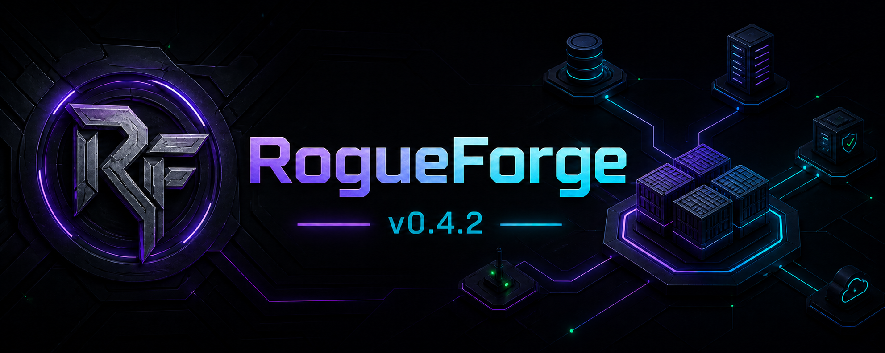

# RogueForge 0.4.2

**A secure, local-first command centre for Podman Compose stacks.**

RogueForge discovers existing stacks and containers, shows their state, reads logs, and performs authenticated lifecycle and Compose operations. Its layout is inspired by the clarity of Dockge and Uptime Kuma while retaining an original implementation and visual identity.

## What v0.4.2 provides

- First-install helper that prepares `/opt/media-server/rogueforge` automatically.
- Prebuilt multi-architecture image from GitHub Container Registry.
- Rootless Podman inventory and controls through the owner’s Unix socket.
- Shared `media-net` networking for Nginx Proxy Manager.
- Persistent local account data in `./data`.
- Administrator login, signed sessions, CSRF protection, and throttled authentication.
- Optional icons from `/opt/media-server/rogue-dashboard/app/static/icons`.
- Configurable installation, stacks, icon, port, network, and public URL values.
- Correct session cookies for direct LAN HTTP and reverse-proxied HTTPS login.
- In-place upgrades with image preflight, health verification, and rollback.

## Install from scratch

### Requirements

- Linux server with rootless Podman configured for the installation user.
- `podman-compose`, Python 3, `curl`, and `sudo`.
- Git for the recommended installation method.
- The account that owns the existing Podman containers and `media-net` network.

### 1. Download the deployment files

Run as the rootless Podman owner—`administrator` on the reference server:

```bash
cd /tmp
git clone https://github.com/RogueAssassin/RogueForge.git rogueforge-install
cd rogueforge-install
git checkout v0.4.2
```

### 2. Run the installer

```bash
chmod +x install.sh
./install.sh
```

The installer pulls `ghcr.io/rogueassassin/rogueforge:0.4.2` before changing the host. It then:

1. Creates `/opt/media-server/rogueforge` and its protected `data/` directory.
2. Writes `.env` and installs the Compose deployment files.
3. Detects the rootless user ID and mounts that user’s Podman socket.
4. Asks you to create the first local administrator password.
5. Creates or reuses `media-net`.
6. Pulls and starts the RogueForge container.
7. Waits for the health endpoint before reporting success.

The image contains the application. The repository supplies the host-side installer and Compose configuration; pulling an OCI image alone cannot create those host files safely.

### 3. Open RogueForge

```text
LAN:          http://<server-ip>:17810
NPM upstream: http://rogueforge:7810
Public URL:   https://manage.roguegaming.com.au
```

Sign in with the administrator account created during installation.

## Custom first installation

```bash
./install.sh \
  --install-dir /opt/media-server/rogueforge \
  --stacks-dir /opt/media-server \
  --icons-dir /opt/media-server/rogue-dashboard/app/static/icons \
  --host-port 17810 \
  --network media-net \
  --public-url https://manage.roguegaming.com.au
```

The application folder and stacks root must be different. Paths must be absolute and contain no whitespace.

## What Podman starts

```text
Browser :17810 ──> rogueforge :7810
                         │
                         ├── ./data/auth.json
                         ├── /opt/media-server stacks
                         ├── Rogue Dashboard icons
                         └── rootless Podman socket

Nginx Proxy Manager ── media-net ──> rogueforge:7810
```

## Updating RogueForge

Navigate to the deployment folder and provide the semantic release tag:

```bash
cd /opt/media-server/rogueforge
chmod +x upgrade.sh
./upgrade.sh 0.4.2
```

For a future release, replace `0.4.2` with its new tag. To deliberately follow the mutable GHCR tag:

```bash
cd /opt/media-server/rogueforge
./upgrade.sh latest
```

The upgrader pulls first, backs up `.env`, recreates the container, tolerates transient startup connection errors, and restores the previous image if health verification fails. It preserves `data/auth.json`.

Existing v0.4.1 installations need the upgrader installed once:

```bash
cd /tmp/rogueforge-install
git fetch --tags
git checkout v0.4.2
sudo install -m 0755 upgrade.sh /opt/media-server/rogueforge/upgrade.sh
cd /opt/media-server/rogueforge
./upgrade.sh 0.4.2
```

## Restarting, logs, and stopping

```bash
cd /opt/media-server/rogueforge

podman-compose ps
podman-compose logs -f
podman-compose restart
podman-compose down
```

Do not delete `data/auth.json` unless intentionally resetting the administrator account.

## Login and password recovery

The default username is `administrator`, not `admin`. To replace a forgotten password and invalidate all existing sessions:

```bash
cd /opt/media-server/rogueforge
python3 setup-auth.py --username administrator
podman restart rogueforge
```

## GHCR releases

Normal installations pin the semantic release:

```text
ghcr.io/rogueassassin/rogueforge:0.4.2
```

The workflow produces `0.4.2`, `0.4`, `latest`, and `sha-<commit>` tags when `v0.4.2` is pushed. A release guard rejects a Git tag that does not match the application version.

To publish v0.4.2 after committing the release source:

```bash
git push origin main
git tag v0.4.2
git push origin v0.4.2
```

The package must be public for anonymous Podman pulls. Private packages require `podman login ghcr.io` with a token that has package-read access.

## Reverse proxy

Configure Nginx Proxy Manager with:

| Setting | Value |
| --- | --- |
| Domain | `manage.roguegaming.com.au` |
| Scheme | `http` |
| Forward hostname | `rogueforge` |
| Forward port | `7810` |
| WebSockets | enabled |
| Force SSL | enabled after issuing the certificate |

NPM and RogueForge must share the same rootless `media-net` network.

## Documentation

- [Container deployment](docs/CONTAINER_DEPLOYMENT.md)
- [Installation and reverse proxy](docs/INSTALL.md)
- [GHCR publishing](docs/GHCR.md)
- [Security model](SECURITY.md)
- [Release history](CHANGELOG.md)
- [Milestones](MILESTONES.md)

## Design principles

1. Compose files remain owned by the server administrator.
2. Privileged changes require an authenticated local account.
3. The Podman socket remains a local Unix socket and is never exposed over TCP.
4. Updates preserve host-side account data and configuration.
5. Unknown icons fall back locally without external tracking services.

## Acknowledgements

Dockge and Uptime Kuma are product inspirations. RogueForge is an original implementation and does not copy their source code or branding.
