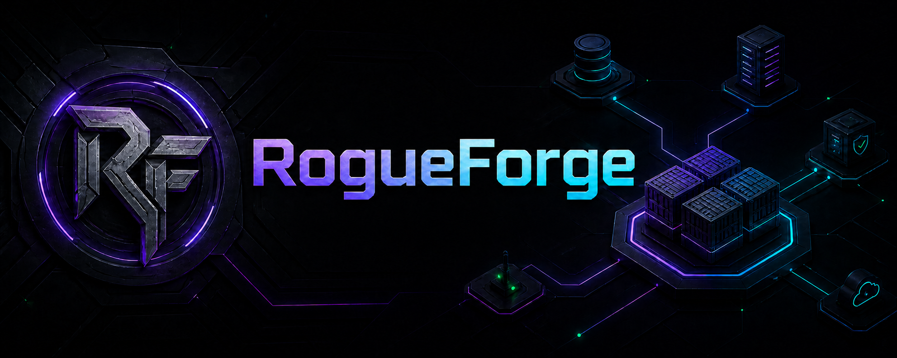

# RogueForge

**A secure, local-first command centre for Docker and Podman Compose stacks.**

RogueForge discovers existing Compose projects and containers, shows runtime state, edits Compose and `.env` files safely, manages stack/service lifecycle, streams logs, and provides authenticated container terminal access through the host container engine.

## Current release: 0.8.0

0.8.0 makes **Stacks** the primary operational surface. Each discovered Compose stack now groups its associated services/containers, status, resource information and service-level controls directly inside the stack view. The old Containers page remains as an advanced **Runtime** view for standalone containers, inspection and troubleshooting.

The interface has been restyled around the new dark RogueForge operations design with neon purple/cyan accents, compact system summaries and denser stack rows. Service icons are pulled automatically from the public `RogueAssassin/rogue-dashboard` icon library, with RogueForge local icons and a generic icon as fallbacks.

## Current features

- Docker and rootless Podman through a mounted Unix socket.
- Flexible recursive Compose discovery using runtime labels, working directories, config-file labels and filesystem scanning.
- Stack Start, Stop, Restart, Recreate and **Update Stack** (`pull` + `up -d --remove-orphans`).
- Stack-level Compose editor with automatic backup and runtime-aware validation.
- Stack-level `.env` editor with automatic backup and validation before save.
- Expandable stack services with individual Start/Stop/Restart/Update, Logs and Terminal controls.
- Authenticated live logs with pause/search/download.
- Authenticated container terminal/exec with shell fallback and automatic cleanup.
- Advanced Runtime page for individual containers, standalone workloads and troubleshooting.
- Container Inspect, resource usage, update checks, Update All and bulk runtime actions.
- Signed administrator sessions, CSRF protection and login throttling.
- RogueForge self-stack/self-container protection.
- Centralized service icons from `RogueAssassin/rogue-dashboard` with local/generic fallback.
- Nginx Proxy Manager support on shared `media-net`.
- Multi-architecture GHCR publishing.
- Runtime-aware upgrades with deployment backup/rollback.

## FEILSBEASTSERVER / default rootless Podman layout

```text
Container owner UID:  1000
Stacks root:          /opt/media-server
RogueForge install:   /opt/media-server/rogueforge
Podman socket source: /run/user/1000/podman/podman.sock
Socket in container:  /run/podman/podman.sock
LAN port:             17810
Container port:       7810
Shared network:       media-net
Public URL:           https://manage.roguegaming.com.au
Account file:         /opt/media-server/rogueforge/data/auth.json
Discovery depth:      4
Discovery cache:      10 seconds
```

The installer derives the rootless Podman socket UID from the user running it. UID 1000 is the repository/default example.

## Centralized icons

RogueForge now prefers the public Rogue Dashboard icon repository:

```text
https://raw.githubusercontent.com/RogueAssassin/rogue-dashboard/main/app/static/icons/<service>.svg
```

The browser falls back to `/api/icons/<service>` and finally `generic.svg` if a centralized icon does not exist. This lets RogueForge and Rogue Dashboard share one icon library without duplicating normal service artwork in every project.

## First installation

Requirements: Linux with rootless Podman or Docker, `podman-compose` for Podman or Docker Compose for Docker, Python 3, `curl`, Git and `sudo`. Run installation as the account that owns the containers, not root.

```bash
cd /tmp
git clone --branch v0.8.0 --depth 1 \
  https://github.com/RogueAssassin/RogueForge.git rogueforge-install-0.8.0
cd rogueforge-install-0.8.0
chmod +x install.sh
./install.sh --engine podman
```

## Existing installation: upgrade

To test the current `main`/`latest` build:

```bash
cd /opt/media-server/rogueforge
./upgrade.sh latest
```

For the immutable release once `v0.8.0` is tagged/published:

```bash
cd /opt/media-server/rogueforge
./upgrade.sh 0.8.0
```

The upgrader preserves `.env` and `data/auth.json`, backs up deployment state, refreshes matching deployment files, recreates RogueForge and verifies `/health`.

## Login and password recovery

The default username is `administrator`.

```bash
cd /opt/media-server/rogueforge
python3 setup-auth.py --username administrator
podman-compose restart
```

## Nginx Proxy Manager

| Setting | Value |
| --- | --- |
| Domain | `manage.roguegaming.com.au` |
| Scheme | `http` |
| Forward hostname | `rogueforge` |
| Forward port | `7810` |
| WebSockets | enabled |
| Block Common Exploits | enabled |
| Force SSL | enabled after certificate issuance |

NPM and RogueForge must both be attached to `media-net`. For live logs, proxy buffering should remain disabled; RogueForge also sends `X-Accel-Buffering: no` on the SSE stream.

## Documentation

- [Roadmap](MILESTONES.md)
- [Installation and reverse proxy](docs/INSTALL.md)
- [Container deployment](docs/CONTAINER_DEPLOYMENT.md)
- [GHCR publishing](docs/GHCR.md)
- [Security model](SECURITY.md)
- [Release history](CHANGELOG.md)

## Acknowledgements

Dockge and Uptime Kuma are product inspirations. RogueForge is an original implementation and does not copy their source code or branding.
