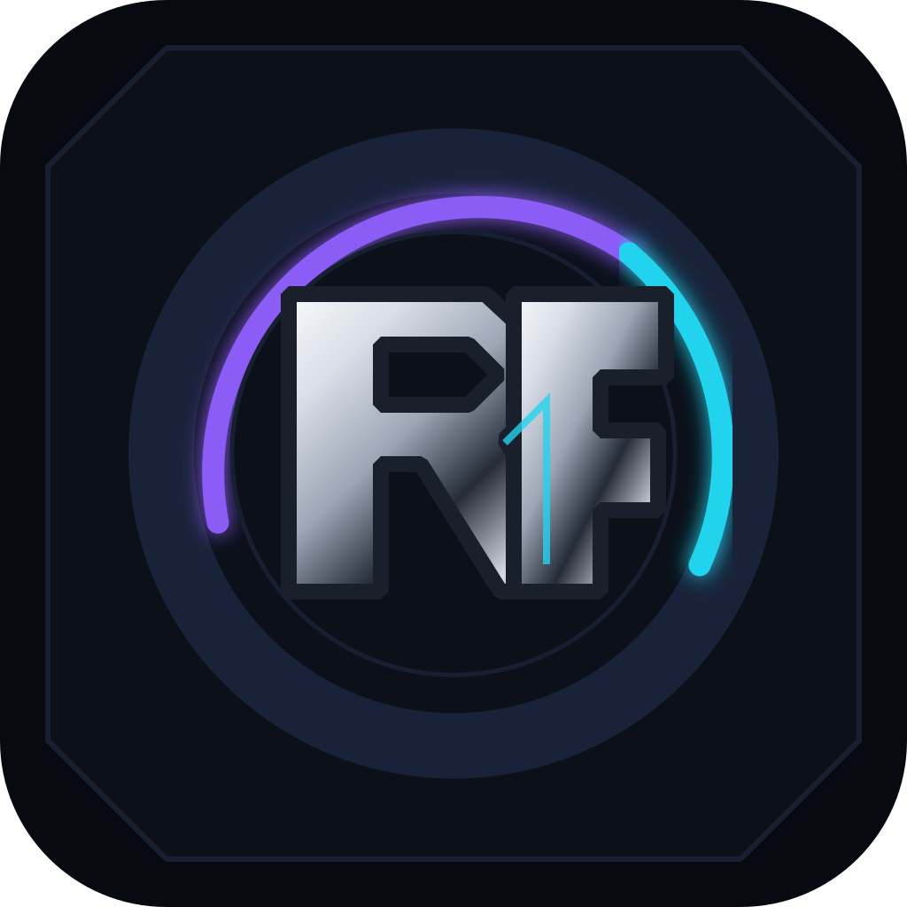

# RogueForge

**A local-first operations console for Docker and Podman Compose.**

## Current release: 0.8.2

RogueForge 0.8.2 consolidates the complete backend into **one maintained runtime file: `rogueforge.py`**. Historical version wrappers and extension modules have been removed so new releases update one runtime rather than layering monkey patches across older versions.

### What it manages

- Recursive Compose stack discovery from runtime labels, working-directory/config-file metadata, and filesystem scanning.
- Docker and rootless Podman through a mounted Unix socket.
- Stack Start, Stop, Restart, Pull, Recreate, and Update (`pull` + `up -d --remove-orphans`).
- Compose and `.env` editing with backups and runtime-aware validation.
- Service/container Start, Stop, Restart, Update, Recreate, Remove, Inspect, image checks, bulk actions, and resource statistics.
- Live logs over authenticated Server-Sent Events.
- Authenticated container terminal/exec sessions with Bash → `sh` fallback and automatic cleanup.
- RogueForge self-container/self-stack protection.
- Signed administrator sessions, CSRF protection, and login throttling.
- Centralized stack/service icons from [Dashboard Icons](https://dashboardicons.com/icons), with local fallback assets.

## Repository layout

```text
rogueforge.py          # complete application runtime
setup-auth.py          # administrator password maintenance
install.sh             # first installation
update.sh              # updates/releases
compose.yaml            # deployment
Containerfile           # image build
static/                 # web interface and RogueForge branding
tests/                  # validation tests
docs/                   # deployment documentation
```

There are no versioned `rogueforge_v*.py` entry points and no runtime extension modules.

## FEILSBEASTSERVER / default rootless Podman layout

```text
Stacks root:          /opt/media-server
RogueForge install:   /opt/media-server/rogueforge
Podman socket source: /run/user/1000/podman/podman.sock
Socket in container:  /run/podman/podman.sock
LAN port:             17810
Container port:       7810
Shared network:       media-net
Public URL:           https://manage.roguegaming.com.au
Discovery depth:      4
Discovery cache:      10 seconds
```

The installer derives the Podman socket from the user who runs it; UID 1000 is only the default example.

## Install

Run as the user that owns the containers, not root:

```bash
cd /tmp
curl -fsSLO https://raw.githubusercontent.com/RogueAssassin/RogueForge/main/install.sh
chmod +x install.sh
./install.sh --engine podman
```

## Update

`update.sh` is the supported update path.

Latest build from `main`:

```bash
cd /opt/media-server/rogueforge
./update.sh latest
```

Immutable tagged release:

```bash
./update.sh 0.8.2
```

If an older installation does not have `update.sh` yet, bootstrap it once:

```bash
cd /opt/media-server/rogueforge
curl -fsSL https://raw.githubusercontent.com/RogueAssassin/RogueForge/main/update.sh -o update.sh
chmod +x update.sh
./update.sh latest
```

The updater preserves `.env` and `data/auth.json`, records deployment backups under `data/update-backups/`, updates the image, recreates RogueForge, and verifies `/health`.

## Administrator account

```bash
cd /opt/media-server/rogueforge
python3 setup-auth.py --username administrator
podman-compose restart rogueforge
```

## Branding and service icons

RogueForge includes only its approved Base, Dark, and Light icon assets under `static/branding/`. Stack/service icons are resolved in the browser from Dashboard Icons' centralized CDN and fall back to RogueForge's local icon endpoint when needed.

## Reverse proxy

For Nginx Proxy Manager, forward `https://manage.roguegaming.com.au` to `http://rogueforge:7810` on the shared `media-net`. Enable WebSockets and SSL. Live-log streaming sends `X-Accel-Buffering: no`.

## Documentation

- [Roadmap](MILESTONES.md)
- [Installation and reverse proxy](docs/INSTALL.md)
- [Container deployment](docs/CONTAINER_DEPLOYMENT.md)
- [GHCR publishing](docs/GHCR.md)
- [Security model](SECURITY.md)
- [Release history](CHANGELOG.md)

## Acknowledgements

Dockge and Uptime Kuma are product inspirations. RogueForge is an original implementation and does not copy their source code or branding.
